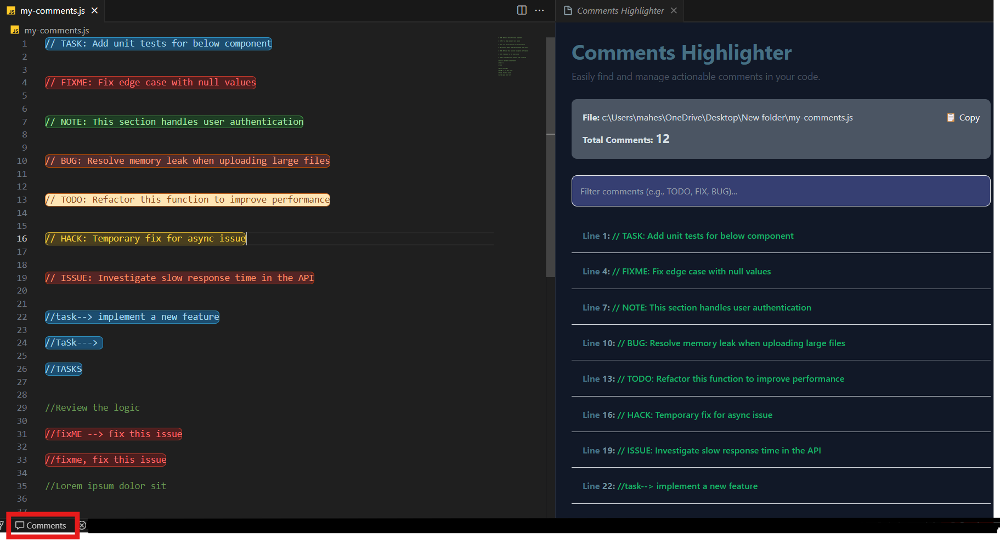

# Comments Highlighter

**Comments Highlighter** is a Visual Studio Code extension designed to boost productivity by visually emphasizing actionable comments in your code, such as `TODO`, `FIXME`, and more. It helps developers easily track and manage tasks, bugs, and notes directly in the code editor.

## Example of Highlighted Comments

This is how your actionable comments will appear in the editor:




## ✨ Features

- Highlights actionable comments (`TODO`, `FIXME`, `NOTE`, `TASK`, `BUG`, `HACK`, `ISSUE`) in your code.
- Uses custom styles, including:
  - Distinct background colors for each type.
  - Border and text styling for better visibility.
- Works seamlessly with multiple programming languages.
- Supports user-defined comment styles based on the language of your project.
  
## 🚀 Getting Started

### Installation

1. Install the extension directly from the [Visual Studio Marketplace](#). *([Comments Highlighter](https://marketplace.visualstudio.com/items?itemName=mahesh-abeykoon.comments-highlighter))*  
   **OR**
2. Install the extension locally:
   - Package the extension using `vsce package` (if not already done).
   - Run the following command in your terminal:
     ```bash
     code --install-extension <path-to-your-extension>.vsix
     ```

### Usage

- Open your project in Visual Studio Code.
- Comments such as `// TODO:`, `// FIXME:`, or other supported keywords will be automatically highlighted.

### Supported Keywords and Styles

| **Keyword** | **Description**       | **Style**                |
|-------------|-----------------------|--------------------------|
| TODO        | Task to be completed  | Yellow background        |
| FIXME       | Needs fixing          | Light red background     |
| NOTE        | Important note        | Light green background   |
| TASK        | Work item             | Light green background   |
| BUG         | Identified bug        | Light red background     |
| ISSUE       | Problem to address    | Light red background     |
| HACK        | Temporary workaround  | Yellow background        |

## ⚙️ Configuration

This extension is designed to work out of the box, but you can modify or add comment patterns in the source code if needed. Check the `updateDecorations` function for customization.

## 🛠️ Development

### Prerequisites

- Install [Node.js](https://nodejs.org/).
- Install [Visual Studio Code](https://code.visualstudio.com/).
- Install `vsce` to package and publish the extension:
  ```bash
  npm install -g @vscode/vsce

git clone <https://github.com/Mahesh-Abeykoon/comments-highlighte>

Running Locally

Clone the repository:
  ```bash
git clone <https://github.com/Mahesh-Abeykoon/comments-highlighte>
````

Navigate to the project folder:
  ```bash
cd todo-highlighter
````
Install dependencies:
````bash
npm install
`````

Open the project in VS Code:
````bash
code .
````

Press F5 to run the extension in the Extension Development Host.

📝 License
This project is licensed under the MIT License.


Developed by Mahesh Abeykoon.

